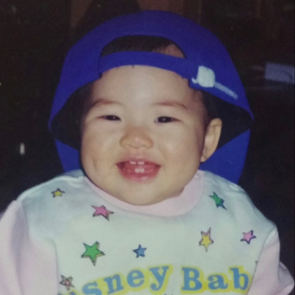

# Home

<a class="home-link" href="saerom/saerom-1" markdown="1">
<figure markdown="1">

<figcaption>가로새롬</figcaption>
</figure>
</a>

<a class="home-link" href="hayoung/hayoung-1" markdown="1">
<figure markdown="1">

<figcaption>하영</figcaption>
</figure>
</a>

<a class="home-link" href="jiwon/jiwon-1" markdown="1">
<figure markdown="1">

<figcaption>지원</figcaption>
</figure>
</a>

<a class="home-link" href="jisun/jisun-1" markdown="1">
<figure markdown="1">

<figcaption>지선</figcaption>
</figure>
</a>

<a class="home-link" href="https://fromis-wv.github.io/" markdown="1">
<figure markdown="1">

<figcaption>Posts</figcaption>
</figure>
</a>

<a class="home-link" href="seoyeon/seoyeon-1" markdown="1">
<figure markdown="1">

<figcaption>더여니</figcaption>
</figure>
</a>

<a class="home-link" href="chaeyoung/chaeyoung-1" markdown="1">
<figure markdown="1">

<figcaption>이채영</figcaption>
</figure>
</a>

<a class="home-link" href="nagyung/nagyung-1" markdown="1">
<figure markdown="1">

<figcaption>이나경</figcaption>
</figure>
</a>

<a class="home-link" href="jiheon/jiheon-1" markdown="1">
<figure markdown="1">

<figcaption>지헌</figcaption>
</figure>
</a>

